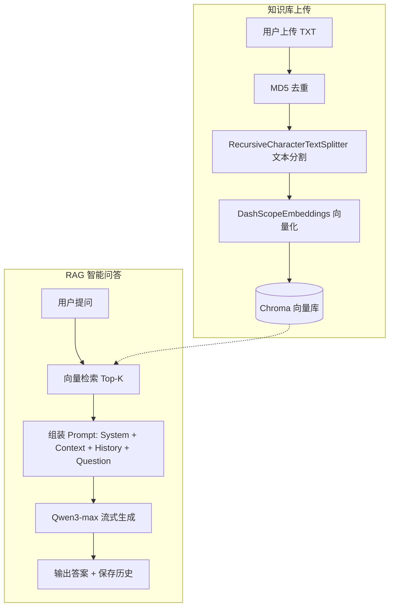
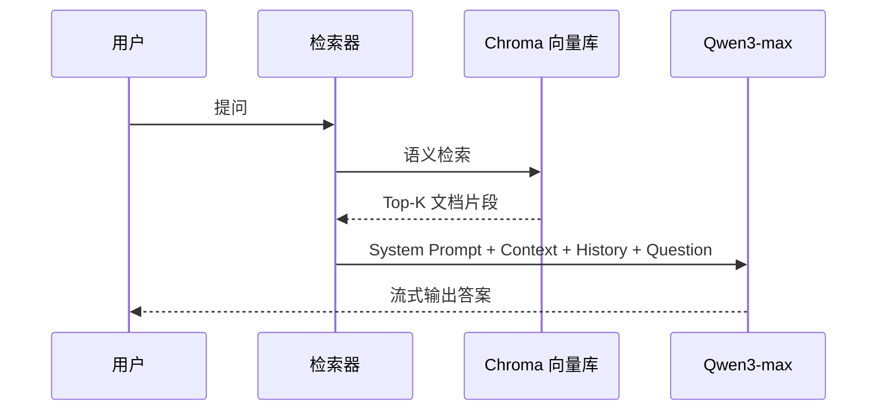

# KnowledgeBase-RAG-LLM-System

基于 **LangChain + Chroma + Qwen** 的本地知识库 RAG 问答系统。

---

## 项目简介

一个完整的 **RAG（Retrieval-Augmented Generation）检索增强生成** 实践项目，基于 Streamlit 构建 Web 界面，实现本地知识库的上传、向量化存储与智能问答。支持多轮对话、流式输出和会话历史管理。

**技术栈：** `Python` `Streamlit` `LangChain` `Chroma` `DashScope Embeddings` `Qwen3-max`

---

## 系统架构

---

## RAG 核心链路

**流程说明：**

1. **索引阶段** — 上传 TXT → MD5 去重 → 递归文本分割(chunk_size=1000, overlap=100) → Embedding 向量化 → 存入 Chroma
2. **检索阶段** — 用户问题向量化 → Chroma 语义相似度匹配 → 返回 Top-K 相关文档片段
3. **生成阶段** — `System Prompt + 检索上下文 + 对话历史 + 用户问题` 组装 → Qwen3-max 流式生成回答

---

## 核心功能

| 功能 | 说明 |
|------|------|
| 知识库上传 | Web 端上传 TXT 文件，自动分段向量化入库 |
| MD5 去重 | 相同内容不重复写入，节省存储和计算资源 |
| 语义检索 | 基于向量相似度从 Chroma 检索最相关文档片段 |
| RAG 问答 | 结合检索上下文 + 历史消息，大模型综合回答 |
| 流式输出 | 实时逐字展示 AI 回答，提升交互体验 |
| 会话历史 | 对话记录持久化存储，支持多轮连续问答 |

---

## 配置说明

核心配置位于 `config_data.py`：

| 参数 | 默认值 | 说明 |
|------|--------|------|
| `chunk_size` | `1000` | 文本分割最大长度 |
| `chunk_overlap` | `100` | 相邻文本段重叠长度 |
| `similarity_threshold` | `1` | 检索返回文档数量 (Top-K) |
| `embedding_model_name` | `text-embedding-v4` | 阿里云嵌入模型 |
| `chat_model_name` | `qwen3-max` | 通义千问对话模型 |
| `collection_name` | `rag` | Chroma 集合名称 |
| `persist_directory` | `./chroma_db` | 向量库持久化路径 |

**环境变量：** 需在 `.env` 中配置 `DASHSCOPE_API_KEY`（参考 `.env.example`）
