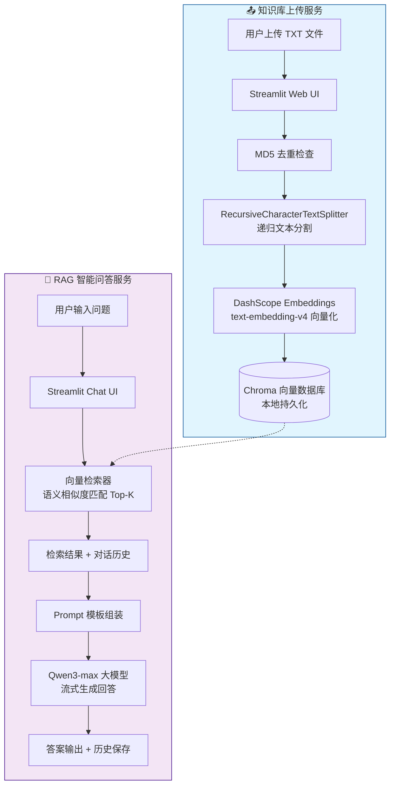
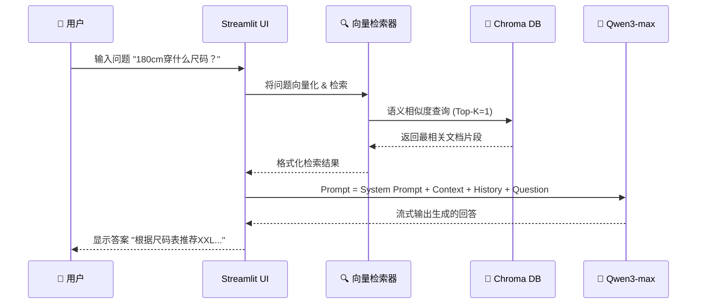
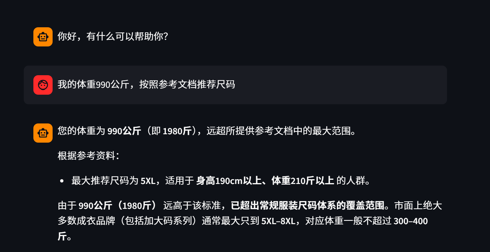
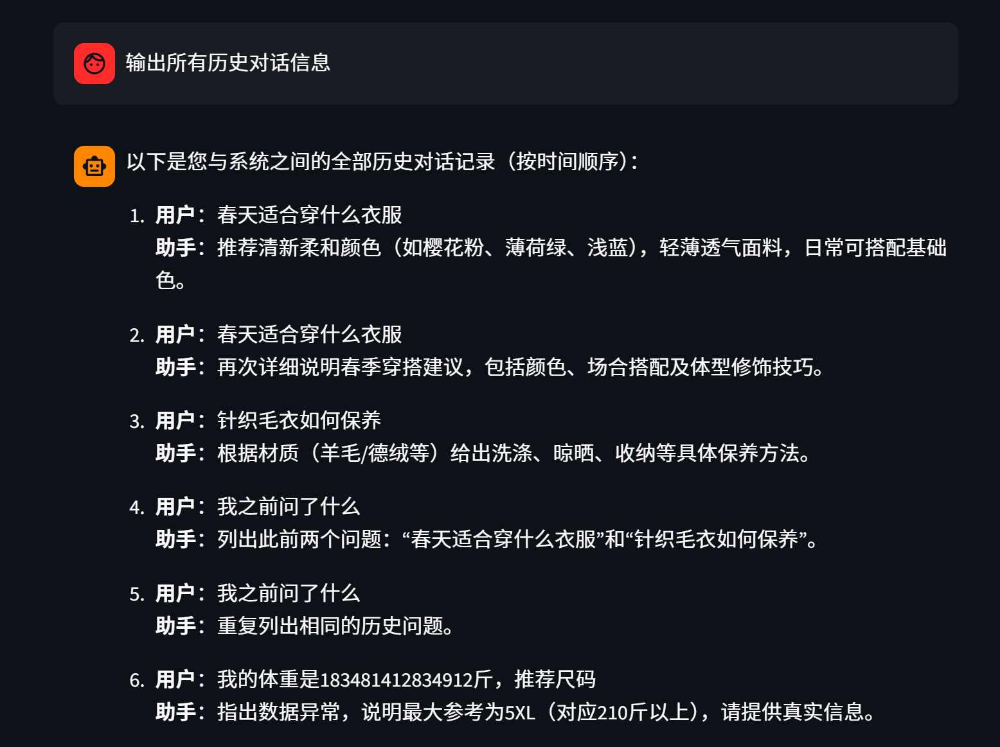

# 🤖 KnowledgeBase-RAG-LLM-System

<div align="center">

**基于 LangChain + Chroma + Qwen 的本地知识库 RAG 问答系统**

[](https://www.python.org/)
[](https://streamlit.io/)
[](https://www.langchain.com/)
[](https://www.trychroma.com/)
[](https://tongyi.aliyun.com/)
[](./LICENSE)

</div>

---

## 📖 项目简介

一个完整的 **RAG（Retrieval-Augmented Generation）检索增强生成** 实践项目，基于 Streamlit 构建 Web 界面，实现本地知识库的上传、向量化存储与智能问答。

> 🎯 **面试亮点：** 本项目展示了 RAG 架构的完整理解——从文档摄取、文本分割、向量化存储、语义检索到 LLM 生成的全链路实现。

---

## 🏗️ 系统架构



### RAG 核心链路



---

## ✨ 核心功能

| 模块 | 功能 | 技术实现 |
|------|------|----------|
| 📤 **知识库管理** | TXT 文件上传 → 自动分段 → 向量化入库 | `RecursiveCharacterTextSplitter` + `DashScopeEmbeddings` |
| 🔍 **语义检索** | 基于用户问题检索最相关文档片段 | Chroma 向量数据库 + `similarity_search` |
| 💬 **智能问答** | 结合检索上下文 + 对话历史生成回答 | LangChain Chain + `Qwen3-max` |
| 📝 **历史管理** | 会话历史持久化，支持多轮对话 | `FileChatMessageHistory` + JSON 本地存储 |
| 🚫 **MD5 去重** | 相同内容文件不重复入库 | hashlib MD5 哈希校验 |
| ⚡ **流式输出** | 实时逐字展示 AI 回答 | Streamlit `write_stream` |

---

## 🧩 项目结构

```text
KnowledgeBase-RAG-LLM-System/
├── app_upload.py              # Streamlit 知识库上传 Web 服务
├── app_chat.py                # Streamlit RAG 智能客服 Web 服务
├── knowledge_base.py          # 知识库核心：读取/切分/写库/MD5去重
├── rag.py                     # RAG 链组装：Retrieval → Prompt → LLM → Output
├── vector_stores.py           # Chroma 向量库检索器封装
├── file_history_store.py      # 会话历史文件存储（FileChatMessageHistory）
├── config_data.py             # 模型/路径/chunk 等核心参数配置
├── requirements.txt           # 完整项目依赖（含版本约束）
├── .env.example               # 环境变量模板
├── .gitignore                 # Git 忽略规则
├── assets/                    # README 演示截图 & 示例知识库文本
├── chroma_db/                 # Chroma 向量数据库持久化目录（本地）
└── chat_history/              # 用户会话历史存储目录（本地）
```

---

## 🚀 快速开始

### 1. 环境准备

```bash
# 克隆项目
git clone https://github.com/你的用户名/KnowledgeBase-RAG-LLM-System.git
cd KnowledgeBase-RAG-LLM-System

# 创建虚拟环境（推荐）
python -m venv venv
venv\Scripts\activate  # Windows
# source venv/bin/activate  # macOS/Linux

# 安装依赖
pip install -r requirements.txt -i https://pypi.tuna.tsinghua.edu.cn/simple
```

### 2. 配置 API Key

```bash
# 复制环境变量模板
cp .env.example .env

# 编辑 .env 文件，填入你的 DashScope API Key
# 前往 https://dashscope.aliyun.com 申请
DASHSCOPE_API_KEY=你的API_Key
```

### 3. 启动服务

```bash
# 终端1：启动知识库上传服务（端口 8501）
streamlit run app_upload.py

# 终端2：启动 RAG 智能客服（端口 8502）
streamlit run app_chat.py --server.port 8502
```

---

## ⚙️ 配置说明

在 `config_data.py` 中可按需调整：

| 参数 | 默认值 | 说明 |
|------|--------|------|
| `chunk_size` | 1000 | 文本分割最大长度 |
| `chunk_overlap` | 100 | 文本段重叠长度 |
| `similarity_threshold` | 1 | 检索返回 Top-K 文档数 |
| `embedding_model_name` | `text-embedding-v4` | 阿里云嵌入模型 |
| `chat_model_name` | `qwen3-max` | 通义千问对话模型 |
| `collection_name` | `rag` | Chroma 集合名称 |

---

## 🎯 面试技术要点

### 1. RAG 架构理解
- **为什么需要 RAG？** 解决 LLM 的幻觉问题、知识时效性问题、私有知识利用问题
- **RAG 的核心三阶段：** ① 索引（Indexing）→ ② 检索（Retrieval）→ ③ 生成（Generation）

### 2. 文本分割策略
- 使用 `RecursiveCharacterTextSplitter` 递归分割，按 `\n\n` → `\n` → `。` → `！` 逐步尝试
- chunk_size=1000 + chunk_overlap=100 保证语义连贯性

### 3. 向量化与检索
- 选用阿里云 `text-embedding-v4` 嵌入模型（1024维向量）
- Chroma 本地持久化，支持余弦相似度检索

### 4. Prompt Engineering
```
System: 以我提供的已知参考资料为主，简洁和专业的回答用户问题。
        参考资料:{context}
System: 并且我提供用户的对话历史记录
[历史消息]
User: {input}
```

### 5. 工程实践
- MD5 去重避免重复入库
- 流式输出提升用户体验
- 会话状态管理（Streamlit session_state）
- 对话历史持久化（FileChatMessageHistory）

---

## 🔮 优化方向

| 方向 | 技术方案 |
|------|----------|
| 检索质量提升 | 添加 Rerank 重排序（如 Cohere Rerank / BGE Reranker） |
| 多模态支持 | 支持 PDF / Word / Markdown 文件上传解析 |
| 向量库升级 | Chroma → FAISS / Milvus（更高性能） |
| 混合检索 | 稀疏检索(BM25) + 稠密检索 混合 |
| Agent 化 | 接入 LangChain Agent，支持工具调用 |
| 多模型 | 支持模型切换（DeepSeek / GPT / Claude） |
| 监控追踪 | 集成 LangSmith / LangFuse 追踪链路 |

---

## 🖼️ 效果预览

<div align="center">
  
  <p><em>知识库预置了衣物尺码推荐、材质养护、搭配建议等内容</em></p>
  
  <p><em>支持结合历史消息进行连续多轮问答</em></p>
</div>

---

## 📄 License

本项目采用 [MIT License](./LICENSE)，仅用于学习与交流。

---

## 🙏 致谢

- [LangChain](https://www.langchain.com/) — RAG 链式调用框架
- [Chroma](https://www.trychroma.com/) — 轻量级向量数据库
- [Streamlit](https://streamlit.io/) — Python Web UI 框架
- [阿里云百炼](https://dashscope.aliyun.com) — Qwen 大模型 & Embedding 服务
